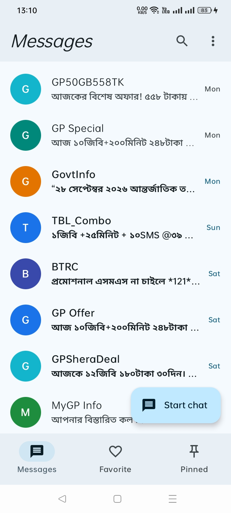
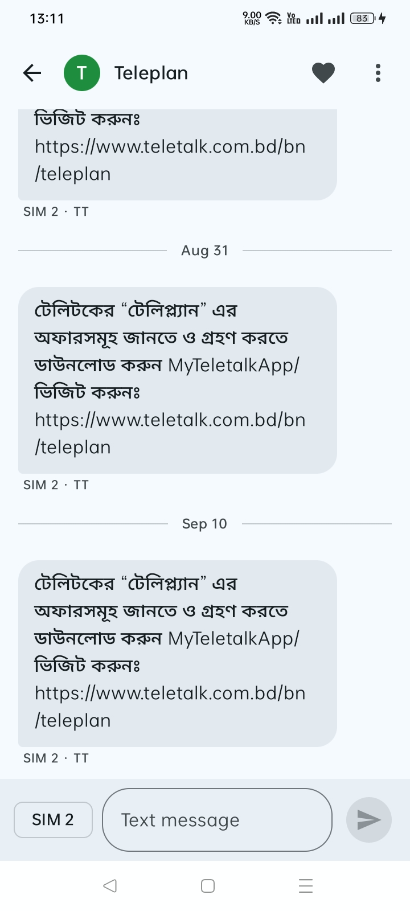
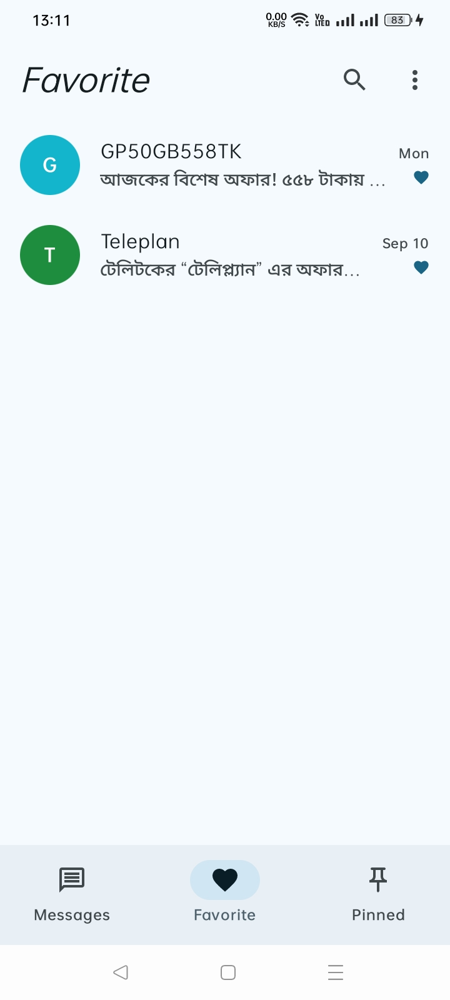
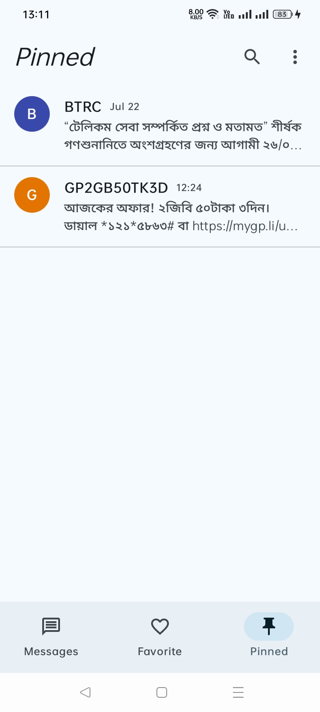
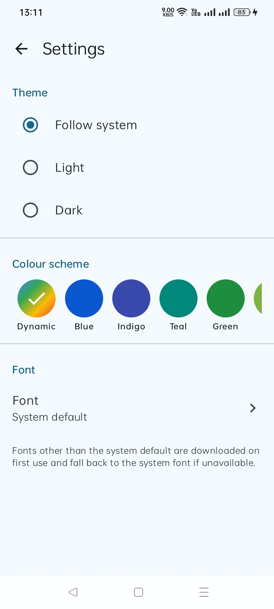

<div align="center">

# SmsMan

**A private, open-source SMS app for Android, built with Jetpack Compose and Material 3 Expressive.**

[](https://github.com/AbrarShakhi/smsman/releases/)
[](LICENSE)


</div>

---

## Overview

SmsMan replaces the system messaging app as your default SMS app. It is designed to be fast, private and pleasant to use. The app has no accounts, advertising, analytics or crash reporting, and it does not request permission to access the Internet: your messages are processed on your device.

## Screenshots

<p align="center">
  
  
  
  
  
</p>

## Features

- **Messaging:** send, receive and store SMS messages, with sent and delivery status for outgoing messages.
- **Conversations:** browse every conversation, keep important conversations on the **Favorite** tab and pin individual messages to the **Pinned** tab.
- **Conversation view:** messages are aligned to one edge and grouped by sender, with the sender's name, the time and the SIM shown above each group.
- **Search:** find messages and contacts across all conversations.
- **New conversations:** start a conversation with any contact or phone number.
- **Dual SIM:** choose the SIM that sends each message.
- **Notifications:** reply to messages and mark them as read directly from the notification.
- **Personalisation:** light, dark or system theme; colours based on your wallpaper (Android 12 and later) or a preset accent colour; and a choice of fonts.
- **Material 3 Expressive:** expressive components, motion and animated illustrations, with predictive back and a swipe gesture to leave a conversation.
- **Built-in documents:** the About page, Terms and Conditions, Privacy Policy, licence and credits are available offline in **Settings**.

## Requirements

- Android 11 (API level 30) or later, on a device with telephony support.
- SmsMan must be set as the default SMS app to send, receive and store messages.

## Installation

1. Download the APK from the [latest release](https://github.com/AbrarShakhi/smsman/releases/latest).
2. Open the file on your Android device and, if prompted, allow installation from this source.
3. Launch SmsMan, grant the requested permissions and set it as your default SMS app.

## Permissions

| Permission | Purpose |
|---|---|
| `READ_SMS`, `SEND_SMS`, `RECEIVE_SMS` | Read, send and receive text messages |
| `RECEIVE_MMS`, `RECEIVE_WAP_PUSH` | Required by Android for the default SMS app role |
| `READ_CONTACTS` | Show contact names and suggest recipients |
| `READ_PHONE_STATE` | Identify SIM cards so that you can choose the sending SIM |
| `POST_NOTIFICATIONS` | Notify you of new messages |

SmsMan does not request the Internet permission and does not send your information to the developer. The [Privacy Policy](docs/PRIVACY.md) describes in detail how the app handles information.

## Known limitations

- **Multimedia messages (MMS) are not supported.** While SmsMan is the default SMS app, incoming multimedia messages are not stored.
- **Replying to calls with a message** is not yet available.
- **Messaging links** (`sms:` and `smsto:`) open the conversation list instead of a new message to the recipient.

## Building from source

Prerequisites:

- JDK 17 or later to start Gradle. The build itself runs on JDK 25, which Gradle provisions automatically if it is not installed (see `gradle/gradle-daemon-jvm.properties`).
- The Android SDK with the API level 37 platform. Android Studio installs the required components.

```bash
git clone https://github.com/AbrarShakhi/smsman.git
cd smsman
./gradlew assembleDebug
```

The APK is generated in `app/build/outputs/apk/debug/`.

To run the tests:

```bash
./gradlew testDebugUnitTest           # host tests
./gradlew connectedDebugAndroidTest   # instrumented tests on a connected device
```

### Project documents

The files in [`docs/`](docs) and the [`LICENSE`](LICENSE) file are the single source of the app's About, Terms and Conditions, Privacy Policy, Licence and Credits screens. During each build, the `generate<Variant>DocumentAssets` Gradle task (for example, `generateDebugDocumentAssets`) packages them into the app's assets, and the build fails if any of them is missing. To change a document, edit it in the repository; the app includes the change in its next build.

The in-app viewer supports headings, paragraphs, bulleted and numbered lists, block quotes, code blocks, emphasis, inline code and links. Relative links between documents, such as `[Privacy Policy](PRIVACY.md)`, open the corresponding document within the app. Tables and HTML are not supported.

## Tech stack

- **Kotlin** and **Jetpack Compose** with **Material 3 Expressive**
- **Navigation 3**, with a separate back stack for each tab
- **Room** for favourites and pins, and **DataStore** for preferences
- **Koin** for dependency injection
- **Lottie** for animated illustrations and **MaterialKolor** for dynamic colour schemes
- Android Telephony provider APIs

## Documentation

- [About SmsMan](docs/ABOUT.md)
- [Terms and Conditions](docs/TERMS.md)
- [Privacy Policy](docs/PRIVACY.md)
- [Credits](docs/CREDITS.md)
- [Licence](LICENSE)

## Contributing

Bug reports, feature requests and pull requests are welcome. Please [open an issue](https://github.com/AbrarShakhi/smsman/issues) to discuss significant changes before you start work, and make sure that the build and tests pass before you submit a pull request.

## Support

If you find SmsMan useful, please consider starring the repository and recommending the app to others.

## Licence

SmsMan is distributed under the [MIT License](LICENSE). Copyright © 2026 AbrarShakhi.
